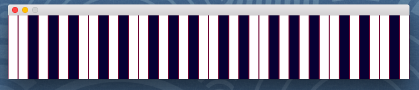

Python Tools
===============

## MIDI  
send and reciever MIDI Message  
with python pygame Libraly 

* midi_scan.py  
scan MIDI Device  

* midi_keyboard.py  
send MIDI Message when touch key  
  

* midi_reciever.py  
reciever MIDI Message  

## others  
* my_ip_address.py  
print my IP address  

### Reference  
https://www.pygame.org/
